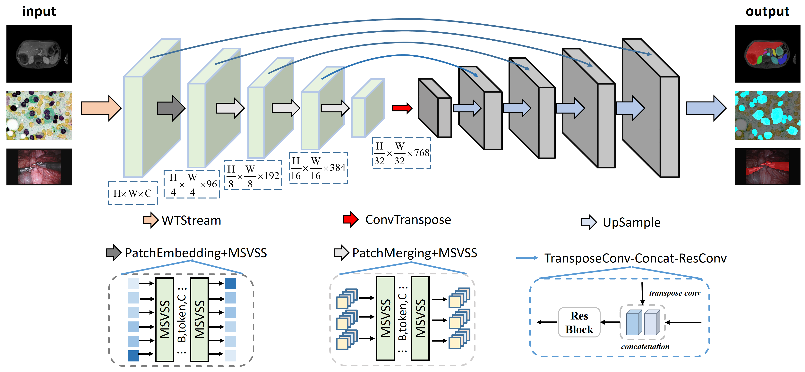
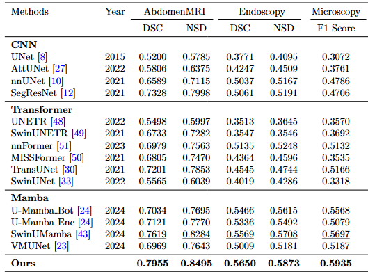

# MSMamba: Enhancing Medical Image Segmentation with a Multi-Scanning Mamba Hybrid Network



##main result


## Installation

**Step-1:** Create a new conda environment & install requirements

```shell
conda create -n MSMamba python=3.10
conda activate MSMamba

pip install torch==2.0.1 torchvision==0.15.2
pip install causal-conv1d==1.1.1
pip install mamba-ssm
pip install torchinfo timm numba
```

## Prepare data 

**Dataset:**  

We use the same data & processing strategy following U-Mamba. Download dataset from [U-Mamba](https://github.com/bowang-lab/U-Mamba) and put them into the data folder. Then preprocess the dataset with following command:

```shell
nnUNetv2_plan_and_preprocess -d DATASET_ID --verify_dataset_integrity
```

## Training && Test

```shell
bash scripts/train_AbdomenMR.sh nnUNetTrainerMSMamba
bash scripts/train_Endoscopy.sh nnUNetTrainerMSMamba
bash scripts/train_Microscopy.sh nnUNetTrainerMSMamba
```

## Acknowledgement
We thank the authors of [nnU-Net](https://github.com/MIC-DKFZ/nnUNet), [Mamba](https://github.com/state-spaces/mamba), [UMamba](https://github.com/bowang-lab/U-Mamba), [VMamba](https://github.com/MzeroMiko/VMamba), and [Swin-Unet](https://github.com/HuCaoFighting/Swin-Unet) for making their valuable code & data publicly available.

## Citation
Coming sonn
